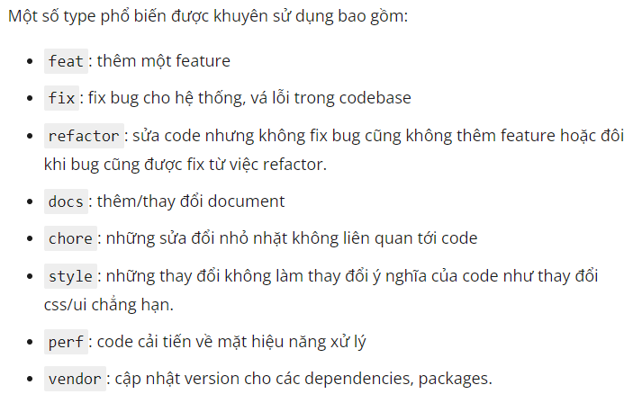

# Ứng dụng quản lý sách

## Bài tập topic 1, ứng dụng Spring Boot và Apache Poi

### Docs:

#### 1. Spring Boot Validation

#### 2. Logging

#### 3. Spring Boot Caching

#### 4. Spring Security
* SecurityContextHolder lưu trữ thông tin chi tiết về người được xác thực
* AuthenticationManager là bộ các API xác định cách SpringSecurityFilter thực hiện authen.
* Authentication: Là đầu vào của AuthenticationManager để cung cấp thông tin xác thực mà người dùng đã đăng nhập hoặc người dùng trong phiên từ SecurityContext
* SecurityContext được lấy từ SecurityContextHolder, chứa Authenticaion của người dùng trong phiên.
* GrantedAuthority: Quyền của principal trong Authentication.
* ProviderManger: cách triển khai phổ biến nhất của AuthenticationManager.
* AuthenticationProvider: được ProviderManager sử dụng để thực hiện một loại authen cụ thể
* Request Credentials with AuthenticationEntryPoint - Yêu cầu thông tin xác thực từ client(chuyển hướng đến trang đăng nhập)
* AbstractAuthenticationProcessingFilter: Filter cơ sở dùng để xác thực, 
#### 5. Apache Poi
Các class trong Apache POI:
a. **HSSF**: Đọc và ghi file theo định dạng Microsoft Excel(XLS - định dạng hỗ trợ của Excel 2003)
b. **XSSF**: Đọc và ghi file theo định dạng Open Office XML (XLSX - định dạng hỗ trợ của Excel 2007 trở lên)
c. **SXSSF**: Là một phần mở rộng API của XSSF, được sử dụng khi xuất các file excel lớn và có bộ nhớ heap space hạn chế.

**Tổng quan:**
* .xls: Tương ứng với phiên bản Microsoft Excel 2003 trở về trước. Được hỗ trợ bởi lớp java với đầu ngữ là **HSSF**.
* .xlsx: phiên bản 2007 trở về sau. Được hỗ trợ bởi các lớp java với tiếp đầu ngữ **XSSF**, **SXSSF**.

**Một số khái niệm:**
* Workbook: đại diện là một file **Excel**. Được implement dưới hai class: **HSSFWorkbook** và **XSSFWorkbook** tương ứng cho định dạng .xls và .xlsx
* Sheet: đại diện cho 1 **Sheet** trong **Excel**. Có 2 class là **HSSFSheet** và **XSSFSheet**.
* Row: đại diện cho 1 hàng. Có 2 class là **HSSFRow** và **XSSFRow**.~~~~
* Cell: đại diện cho 1 ô. Có 2 class là **HSSFCell** và **XSSFCell**

**Khai báo thư viện:**
  <dependency>
        <groupId>org.apache.poi</groupId>
        <artifactId>poi(2003)/poi-ooxml(2007)</artifactId>
        <version>3.17</version>
  </dependency>
#### 6. Conversion of commit
